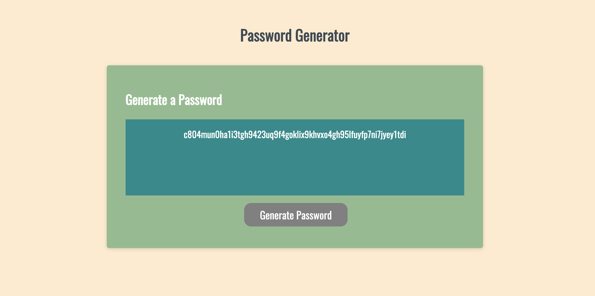

# Password Generator
#### An application that allows users to select criteria to include in a random password.

### I was provided an initial Javascript file, which I have edited in order to provide functionality to the password generator. The ways in which I achieved this were:
    * Providing access to user input, allowing each person to choose the number and types of characters their password will contain.
        * This includes providing error specific feedback, so that the user will know what information was submitted incorrectly.
    * Changing the information that would be added to the array containing possible characters for the password, based on the user's input. 
    * Using a randomization function to select the correct number of characters.
        * The characters are added one at a time, and this process is illustrated within the console.
    * Finally, the user receives their password. 
    
### [PasswordGenerator](https://meganbryan.github.io/PasswordGenerator/)
### 
